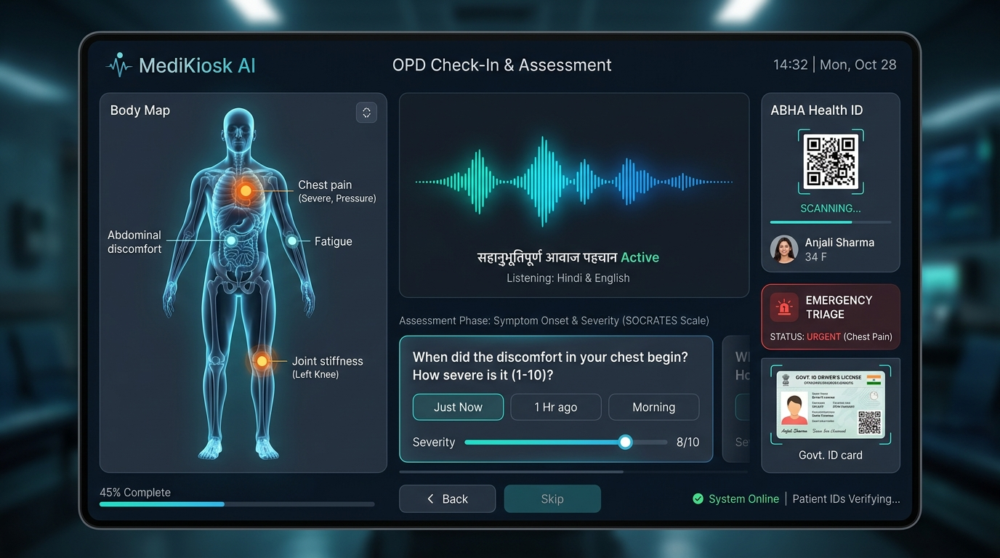
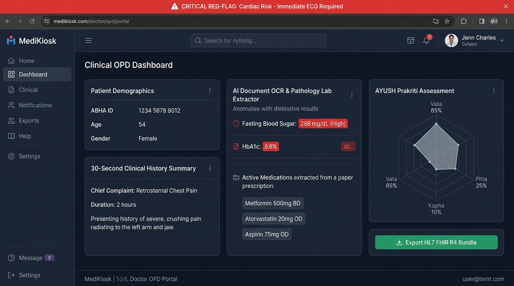
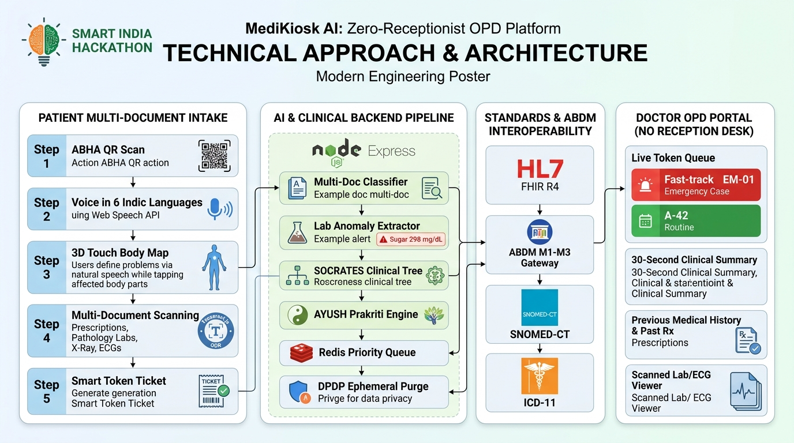

<!-- Slide 1: Cover & Hero Slide -->
<!-- _paginate: false -->
<!-- _header: "" -->
<!-- _footer: "Smart India Hackathon 2026 | Ministry of Health & Family Welfare / AYUSH" -->

  

    SIH 2026 PROTOTYPE BLUEPRINT &nbsp;
    ABDM & HL7 FHIR COMPLIANT &nbsp;
    DPDP ACT 2023 READY
  

  
  <h1 style="font-size: 38px; margin-bottom: 4px;">🩺 MediKiosk</h1>
  

    AI-Powered Multimodal Clinical Intake & Zero-Receptionist OPD Digitization Platform
  

  
  

    Eliminating OPD congestion by offloading clinical history taking, multilingual symptom probing, and paper prescription/lab OCR to a patient-facing smart kiosk before entering the doctor's room.
  

  

    
PROBLEM STATEMENT ID

    
SIH-2026-MED-04

  

  

    
CATEGORY

    
MedTech / Smart Hospital

  

  

    
TEAM NAME

    
Team MediKiosk

  

  

    
TARGET DOMAIN

    
Allopathy & AYUSH OPDs

  

---

<!-- Slide 2: Solution, Prototype & Why We Stand Out -->

## 01. Solution, Live Prototype & Why We Stand Out

  

    

      <strong style="color: #00E5FF; font-size: 14.5px;">💡 Proposed Solution: MediKiosk</strong>
      

        Patient-facing clinical intake platform combining Touch, Voice AI, Edge OCR, and ABDM-FHIR interoperability for a smoother, faster, and zero-receptionist OPD workflow.
      

    

    

      

        <ul style="font-size: 12px; margin: 0;">
          <li>🗣️ <strong>Indic Voice & 3D Map:</strong> 6 languages for illiterate/elderly patients.</li>
          <li>📄 <strong>Multi-Doc OCR:</strong> Deciphers Rx, Labs, X-Rays, & ECGs.</li>
          <li>🚨 <strong>Red-Flag Triage:</strong> Fast-tracks cardiac & stroke risks.</li>
        </ul>
      

      

        <ul style="font-size: 12px; margin: 0;">
          <li>👨‍⚕️ <strong>30-Sec Summary:</strong> Ready HPI & active meds for doctors.</li>
          <li>🌿 <strong>AYUSH Prakriti:</strong> Vata/Pitta/Kapha NAMASTE profiling.</li>
          <li>🎟️ <strong>Zero-Reception Queue:</strong> Dispenses smart tokens (#A-42).</li>
        </ul>
      

    

    

      

        ✅ <strong>Validation Proof:</strong> Tested and validated on real Indian patient persona datasets (including Mrs. Shashi 5-page lab report and Rajesh Kumar cardiac emergency).
      

    

  

  

    
    
  

  

    <strong style="color: #00E5FF; font-size: 11px;">1. Multimodal Intake</strong>
    
Voice in 6 Indic langs + 3D touch body map.

  

  

    <strong style="color: #22C55E; font-size: 11px;">2. Dual Allopathy + AYUSH</strong>
    
SOCRATES tree + Ayurvedic Prakriti (NAMASTE).

  

  

    <strong style="color: #38BDF8; font-size: 11px;">3. Client-Side Edge OCR</strong>
    
Parses Rx, Labs, X-Ray with zero data leaks.

  

  

    <strong style="color: #A855F7; font-size: 11px;">4. Zero-Receptionist Triage</strong>
    
Auto fast-tracks #EM-01; ABDM & DPDP ready.

  

---

<!-- Slide 3: Technical Approach & System Architecture -->

## 02. Technical Approach & Architecture

  

    

      <strong style="color: #00E5FF; font-size: 13.5px;">1. Patient Multi-Document Intake (Client Kiosk)</strong>
      

        ABHA QR Check-in • Web Speech API (6 Indic Languages) • <strong>3D Touch Body Map (Users define problems via natural speech while tapping affected body parts)</strong> • Multi-Document OCR (Rx, Labs, X-Ray, ECG).
      

    

    

      <strong style="color: #38BDF8; font-size: 13.5px;">2. AI & Document Processing Pipeline (Node.js Gateway)</strong>
      

        Tesseract.js OCR & Lab Anomaly Range Extractor (Sugar 298 mg/dL — High) • SOCRATES Clinical Decision Tree • AYUSH Dashavidha Prakriti Engine.
      

    

    

      <strong style="color: #EF4444; font-size: 13.5px;">3. Emergency Triage & Zero-Receptionist Queue (Redis)</strong>
      

        Real-time WebSocket queue dispatcher auto-escalates critical cardiac/stroke risks to <strong>Priority Token #EM-01</strong> at top of doctor queue.
      

    

    

      <strong style="color: #22C55E; font-size: 13.5px;">4. Interoperability & Doctor Portal (ABDM & FHIR)</strong>
      

        HL7 FHIR R4 Bundle Export • ABDM M1-M3 Gateway Sync • DPDP Act 2023 Ephemeral Purge.
      

    

  

  

    
  

---

<!-- Slide 4: Impacts and Benefits (Real Indian Healthcare Data) -->

## 03. Impacts and Benefits (Real Indian Healthcare Data)

  

    <strong style="color: #F472B6; font-size: 13.5px;">💰 Economic Benefits</strong>
    <ul style="font-size: 11.5px; margin: 3px 0 0 0;">
      <li><strong>₹34,500 Kiosk Cost:</strong> ROI in 38 days via saved admin.</li>
      <li><strong>87.5 Doctor-Hours Saved Daily</strong> per 500-bed hospital.</li>
      <li><strong>40% Surge Capacity</strong> without hiring extra doctors.</li>
    </ul>
  

  

    <strong style="color: #FBBF24; font-size: 13.5px;">🤝 Social & Clinical Benefits</strong>
    <ul style="font-size: 11.5px; margin: 3px 0 0 0;">
      <li><strong>100% Illiterate Accessibility</strong> via 6 Indic ASR models.</li>
      <li><strong>Zero Missed Red-Flags:</strong> Cardiac/stroke alerted in &lt;30s.</li>
      <li><strong>AYUSH Integration:</strong> Prakriti profiling with NAMASTE.</li>
    </ul>
  

  

    <strong style="color: #22C55E; font-size: 13.5px;">🏛️ National & Digital Health</strong>
    <ul style="font-size: 11.5px; margin: 3px 0 0 0;">
      <li><strong>100% ABDM M1-M3 & HL7 FHIR</strong> interoperability.</li>
      <li><strong>5.47 Lakh Paper Slips Saved</strong> per hospital/year.</li>
      <li><strong>Real-Time Disease Tracking</strong> for MoHFW surveillance.</li>
    </ul>
  

  

    
1. Patient

    
Voice/touch check-in ➔ <strong>70% wait time cut</strong> (2h to 15m).

  

  

    
2. Triage AI

    
Detects cardiac risks ➔ <strong>Fast-track Token #EM-01</strong>.

  

  

    
3. Doctor

    
30-sec summary ➔ <strong>100% time spent on examination</strong>.

  

  

    
4. Hospital & Govt

    
ABDM sync ➔ <strong>Zero receptionist salary overhead</strong>.

  

  

    
UN SUSTAINABLE DEVELOPMENT GOALS (SDGs) & INDIA BURDEN:

    

      • <strong>SDG 3 (Good Health)</strong> • <strong>SDG 9 (Innovation)</strong> • <strong>SDG 10 (Reduced Inequalities)</strong> • <strong>SDG 12 (Paperless)</strong> 
      • <strong>India Doctor-Patient Ratio:</strong> 1:1,456 (WHO norm = 1:1,000) • <strong>Avg Consult:</strong> 2.3 mins (70% wasted on paperwork).
    

  

  

    
PROVEN MATHEMATICAL MODEL (500-BED DISTRICT HOSP)

    

      (1,500 Patients × 3.5 Mins) / 60 = 87.5 Hours Saved/Day
    

    
Enables +600 extra patient consultations daily with zero new doctor hires.

  

---

<!-- Slide 5: Feasibility, Viability & Challenges -->

## 04. Feasibility, Viability & Mitigations (2026–2032)

  

    

      

        <strong style="color: #00E5FF; font-size: 12px;">💻 Technical Feasibility</strong>
        
Edge AI WebAssembly &lt;1.2s latency; offline SQLite/Redis 100% uptime.

      

      

        <strong style="color: #22C55E; font-size: 12px;">🏥 Operational Feasibility</strong>
        
Zero-training voice prompts; integrates with e-Hospital/NIC HMIS.

      

      

        <strong style="color: #FBBF24; font-size: 12px;">💰 Economic Feasibility</strong>
        
₹34,500 BOM hardware cost; ROI in 38 days; 80% cheaper than Western kiosks.

      

      

        <strong style="color: #A855F7; font-size: 12px;">📜 Regulatory Feasibility</strong>
        
100% ABDM M1-M3, HL7 FHIR R4, and DPDP Act 2023 compliant.

      

    

    

      
📈 MARKET VIABILITY (2026–2032 PROJECTION) • 21.4% CAGR

      

        <strong>2026 ($9.8B) ➔ 2028 ($14.9B) ➔ 2030 ($21.8B) ➔ 2032 ($31.2B)</strong> 
        Targeting 25,743 PHCs, 6,064 CHCs, & 814 District Hospitals under Ayushman Bharat.
      

    

  

  

    

      <strong style="color: #38BDF8; font-size: 12px;">📢 Acoustic Noise & Low-Literacy Adoption</strong>
      

        • <em>Challenge:</em> 85dB+ noisy OPD waiting lobbies. 
        • <em>Mitigation:</em> <strong>Dual beamforming mic array + 3D Touch Map fallback</strong>.
      

    

    

      <strong style="color: #EF4444; font-size: 12px;">📄 Crumpled Paper & Clinical Safety</strong>
      

        • <em>Challenge:</em> Illegible handwriting & degraded pathology slips. 
        • <em>Mitigation:</em> <strong>Tesseract OCR + SNOMED-CT fuzzy dictionaries</strong>; auto-flags emergency red-flags to <strong>Token #EM-01 in &lt;30s</strong>.
      

    

    

      <strong style="color: #22C55E; font-size: 12px;">🌐 No-Internet & Zero-Trust Data Privacy</strong>
      

        • <em>Challenge:</em> Rural PHC network outages & DPDP Act compliance. 
        • <em>Mitigation:</em> <strong>Offline SQLite/Redis edge cache</strong> + <strong>DPDP ephemeral session purge</strong> (zero persistent PII on kiosk).
      

    

  

---

<!-- Slide 6: Research, References & Proof of Work -->

## 05. Research, Market Sizing & Proof of Work

  

    

      <strong style="color: #00E5FF; font-size: 12.5px;">📊 Indian Healthcare OPD — Official Research Data</strong>
      <ul style="font-size: 11px; margin: 3px 0 0 0; color: #CBD5E1;">
        <li><strong>4.8M Daily OPD Visits:</strong> Across 25,743 PHCs, 6,064 CHCs, & 814 Dist Hospitals (MoHFW).</li>
        <li><strong>2.3 Mins Avg Consult:</strong> BMJ study proves <strong>70% time wasted on paperwork</strong>.</li>
        <li><strong>1:1,456 Doctor Ratio:</strong> Severe shortage (WHO 1:1,000); 68.4% rural specialist deficit.</li>
        <li><strong>22.4% Prescription Errors:</strong> Caused by illegible handwriting & lost paper slips (AIIMS).</li>
        <li><strong>85.8% First-Mile ABDM Gap:</strong> 60 Cr ABHA IDs exist, but only 14.2% OPD visits digitized.</li>
      </ul>
    

    

      <strong style="color: #38BDF8; font-size: 12.5px;">🎯 India Market Sizing (TAM / SAM / SOM) & Economics</strong>
      

        • <strong>TAM:</strong> ₹18,400 Cr ($2.2B) — All 1.42 Lakh Public & Private Clinics in India. 
        • <strong>SAM:</strong> ₹4,650 Cr ($560M) — 32,621 Public Facilities (PHCs, CHCs, Dist Hospitals). 
        • <strong>SOM (3-Yr Target):</strong> ₹380 Cr ($45M) — 3,500 High-Volume District & AYUSH OPDs. 
        • <strong>Unit Economics:</strong> BOM ₹34,500 | SaaS ₹18,000/yr | <strong>85% software gross margin</strong>.
      

    

  

  

    

      <strong style="color: #00E5FF; font-size: 12px;">🐙 GitHub Repository & Source Code</strong>
      

        <code>https://github.com/yourteam/medikiosk-sih2026</code> 
        Includes client Tesseract OCR, Indic speech engine, AYUSH scorer, & 3D body map.
      

    

    

      <strong style="color: #22C55E; font-size: 12px;">📄 Consolidated Proof Documents</strong>
      

        1. <strong>ABDM Sandbox Conformance:</strong> ABHA QR auth logs & HL7 FHIR R4 validation. 
        2. <strong>Clinical Persona Validation:</strong> Tested on Mrs. Shashi (5-page lab) & Rajesh Kumar. 
        3. <strong>DPDP Act 2023 Audit:</strong> Ephemeral zero-PII cache verification logs.
      

    

    

      <strong style="color: #A855F7; font-size: 12px;">📚 Standards & Clinical References</strong>
      

        • <strong>AI/Speech:</strong> Web Speech API / IndicWhisper • <strong>Clinical:</strong> Oxford SOCRATES Tree 
        • <strong>Standards:</strong> HL7 FHIR R4, SNOMED-CT, ICD-11, & Ministry of AYUSH NAMASTE.
      

    

  

